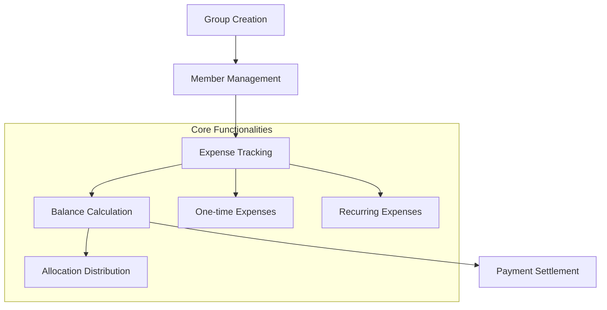

# EIP Protocol: Decentralized Financial Settlement Platform

EIP Protocol is a blockchain-powered financial management solution that enables seamless, transparent expense tracking and settlement across groups, teams, and collaborative networks.

## Overview

EIP Protocol solves critical challenges in group financial management by providing a trustless, decentralized platform for:

- Creating shared financial groups
- Tracking complex expense allocations
- Managing recurring and one-time expenses
- Facilitating transparent payment settlements
- Maintaining precise inter-member financial records

## Key Features

- **Group Management**: Create and manage collaborative financial groups
- **Dynamic Expense Tracking**: Support for varied expense types and allocations
- **Transparent Settlements**: Clear, blockchain-verified payment tracking
- **Flexible Allocation**: Custom percentage-based expense distribution
- **Secure Access Control**: Role-based permissions and member management

## Architecture



### Core Components
- **Groups**: Collaborative financial units
- **Members**: Participants with configurable allocations
- **Expenses**: Tracked financial transactions
- **Balances**: Dynamic inter-member financial standings
- **Settlements**: Transparent payment resolutions

## Getting Started

### Prerequisites
- Stacks wallet
- Basic understanding of blockchain financial protocols

### Basic Usage

1. Create a financial group:
```clarity
(contract-call? .eip-protocol-core create-group "Team Project Expenses")
```

2. Add group members:
```clarity
(contract-call? .eip-protocol-core add-member group-id member-address)
```

3. Record an expense:
```clarity
(contract-call? .eip-protocol-core add-expense group-id "Software Licenses" u500 "equal")
```

## Function Reference

### Group Management

```clarity
(create-group (name (string-ascii 100)))
(add-member (group-id uint) (new-member principal))
(remove-member (group-id uint) (member-to-remove principal))
```

### Expense Management

```clarity
(add-expense (group-id uint) (name (string-ascii 100)) (amount uint) (allocation-type (string-ascii 10)))
(add-recurring-expense (group-id uint) (name (string-ascii 100)) (amount uint) (recurrence-period uint) (allocation-type (string-ascii 10)))
```

### Payment Settlement

```clarity
(settle-payment (group-id uint) (to-member principal) (amount uint))
(record-external-payment (group-id uint) (settlement-id uint) (tx-id (buff 32)))
```

## Development

### Testing
1. Clone the repository
2. Install dependencies: `clarinet install`
3. Run tests: `clarinet test`

### Local Development
1. Start local chain: `clarinet console`
2. Deploy contracts: `clarinet deploy`

## Security Considerations

### Limitations
- Maximum 20 members per group
- Positive integer expense amounts required
- Custom allocations must total 100%

### Best Practices
- Verify member balances before changes
- Ensure accurate expense allocations
- Double-check settlement amounts
- Promptly record external transactions

## License

[Include your license here]

## Contributing

[Include contribution guidelines]